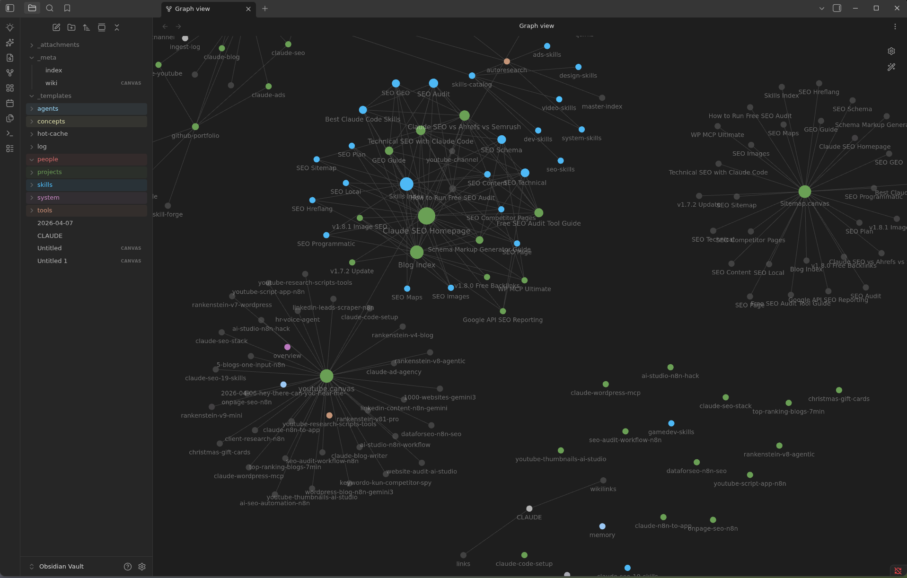
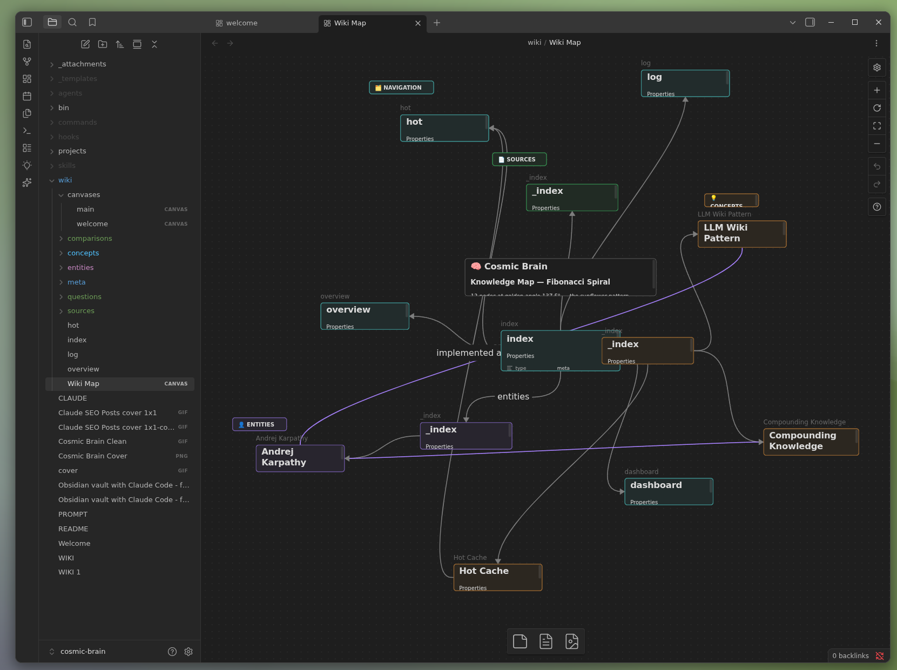

<<<<<<< HEAD

> **Abstract.** `claude-obsidian-OKF` is [CircuitBoardGames](https://github.com/CircuitBoardGames)'
> fork of [AgriciDaniel/claude-obsidian](https://github.com/AgriciDaniel/claude-obsidian) that
> makes the vault's generated output conform to
> [Open Knowledge Format v0.1](https://github.com/scaccogatto/okf-skills) — every wiki page
> carries `type`/`title`/`description`/`timestamp` frontmatter and `wiki/log.md` uses OKF §7's
> date-grouped heading structure — so the vault is a portable, agent-consumable knowledge bundle
> by construction, not just an Obsidian vault tied to this plugin. All upstream functionality
> (ingest, query, lint, save, autoresearch, canvas, methodology modes, thinking loop) is
> unchanged; only the generators that write frontmatter and `log.md` were touched. See
> [OKF Conformance](#okf-conformance) below for what changed and why.

# claude-obsidian-OKF: Self-Organizing AI Second Brain for Obsidian + Claude Code (OKF fork)

=======
>>>>>>> 1c1bc49c03a685ee8f5d09c99efe52b42d6673f5
<p align="center">
  
</p>

<<<<<<< HEAD
[](https://github.com/CircuitBoardGames/claude-obsidian-OKF/stargazers)
[](LICENSE)
[](https://github.com/CircuitBoardGames/claude-obsidian-OKF/actions/workflows/test.yml)
[](https://github.com/scaccogatto/okf-skills)
[](https://code.claude.com/docs/en/discover-plugins)
[](https://obsidian.md)
[](https://agentskills.io)

Claude + Obsidian knowledge companion and self-organizing AI second brain. A running AI notetaker that builds and maintains a persistent, compounding wiki vault. Every source you add gets integrated. Every question you ask pulls from everything that has been read. Knowledge compounds like interest.

Open-source Obsidian AI plugin for AI note-taking, personal knowledge management (PKM), second-brain workflows, and a private Notion alternative. **15 Claude Code skills**, multi-agent support, multi-writer safe (v1.7+), first-class methodology modes (LYT / PARA / Zettelkasten / Generic via v1.8), the 10-principle thinking framework (v1.9), and OKF v0.1-conformant generated output (this fork). Based on [Andrej Karpathy's LLM Wiki pattern](https://gist.github.com/karpathy/442a6bf555914893e9891c11519de94f).

> ℹ️ **This is a fork.** For the upstream project without the OKF changes, see
> [`AgriciDaniel/claude-obsidian`](https://github.com/AgriciDaniel/claude-obsidian). Every install
> command in this README targets this fork
> ([`CircuitBoardGames/claude-obsidian-OKF`](https://github.com/CircuitBoardGames/claude-obsidian-OKF)) —
> installing upstream instead gets you the same plugin without OKF-conformant frontmatter/`log.md`.

> ✨ **v1.7 "Compound Vault" refoundation**: Obsidian CLI as default transport, hybrid retrieval (contextual prefix + BM25 + cosine rerank per [Anthropic's Sept 2024 research](https://www.anthropic.com/news/contextual-retrieval)), per-file advisory locking that closes a latent multi-writer corruption hole, and substrate alignment with [kepano/obsidian-skills](https://github.com/kepano/obsidian-skills). Full guide: [docs/compound-vault-guide.md](docs/compound-vault-guide.md). Optional [DragonScale Memory](docs/dragonscale-guide.md) extension (log folds, deterministic page addresses, semantic tiling lint, boundary-first autoresearch).

---

## Contents

- [What It Does](#what-it-does)
- [OKF Conformance](#okf-conformance)
- [Why claude-obsidian?](#why-claude-obsidian)
- [Quick Start](#quick-start)
- [Commands](#commands)
  - [`/wiki`: setup, scaffold, continue](#wiki-setup-scaffold-continue)
  - [`/autoresearch`: autonomous research loop](#autoresearch-autonomous-research-loop)
  - [`/canvas`: visual layer](#canvas-visual-layer)
  - [`/think`: 10-principle thinking loop](#think-10-principle-thinking-loop)
- [Methodology Modes (v1.8+)](#methodology-modes-v18)
- [Vault Use Cases (v1.0+)](#vault-use-cases-v10)
- [Cross-Project Knowledge Base](#cross-project-knowledge-base)
- [What Gets Created](#what-gets-created)
- [Architecture](#architecture)
- [MCP Setup (Optional)](#mcp-setup-optional)
- [Plugins](#plugins)
- [CSS Snippets](#css-snippets-auto-enabled-by-setup-vaultsh)
- [Banner Plugin](#banner-plugin)
- [File Structure](#file-structure)
- [AutoResearch Configuration](#autoresearch-programmd)
- [Seed Vault](#seed-vault)
- [Companion: claude-canvas](#companion-claude-canvas)
- [FAQ](#faq)
- [Requirements](#requirements)
- [Uninstall](#uninstall)
- [Contributing](#contributing)
- [Related Projects](#related-projects)
- [Community](#community)
- [License](#license)

---

## What It Does

### [YouTube Demo](https://www.youtube.com/watch?v=a2hgayvr-H4)
=======
<h1 align="center">claude-obsidian</h1>
>>>>>>> 1c1bc49c03a685ee8f5d09c99efe52b42d6673f5

<p align="center">
  <strong>Build an Obsidian knowledge base that becomes more useful every time you use it.</strong><br>
  Capture sources, create connected notes, retrieve grounded answers, and keep the vault healthy—without giving up ownership of your files.
</p>

<p align="center">
  <a href="LICENSE"></a>
  <a href="https://agentskills.io"></a>
  <a href="https://code.claude.com/docs/en/plugins"></a>
  <a href="CHANGELOG.md"></a>
</p>

<p align="center">
  <a href="#from-source-to-living-knowledge">See the workflow</a> ·
  <a href="#quick-start">Quick start</a> ·
  <a href="#15-skills-one-system">Explore the skills</a> ·
  <a href="docs/install-guide.md">Installation guide</a> ·
  <a href="docs/windows-wsl.md">Windows &amp; WSL</a>
</p>

<<<<<<< HEAD
## OKF Conformance

This fork's `wiki/` output conforms to [Open Knowledge Format v0.1](https://github.com/scaccogatto/okf-skills) — a portable markdown + YAML frontmatter convention any OKF-aware agent can consume, not just this plugin. What changed vs upstream:

- **Every generated page carries `type`, `title`, `description`, and `timestamp`.** `type` is OKF's one hard conformance rule; `description` and `timestamp` are the recommended fields OKF's checker looks for. All five page templates (`_templates/*.md`), the `wiki-mode` methodology templates, and the inline frontmatter blocks in `save`, `wiki-ingest`, `wiki-fold`, and `autoresearch`'s skill instructions now emit both.
- **`wiki/log.md` uses OKF §7's date-grouped format**: one `## YYYY-MM-DD` heading per day (newest first), with `* **op**: details` bullets underneath — not the old one-heading-per-entry format with the date bracketed and the op/title baked into the heading text, which failed OKF's ISO-8601 heading check.
- **`scripts/tiling-check.py`'s report generator writes frontmatter** (`type: meta`) instead of a bare bullet list.

Conformance is enforced going forward, at the generator — content filed before this fork's changes was not back-filled page-by-page. Validate any `wiki/` directory with the [OKF `validate` skill](https://github.com/scaccogatto/okf-skills)'s checker:

```bash
uv run okf_validate.py wiki --strict
```

Full schema reference: [`skills/wiki/references/frontmatter.md`](skills/wiki/references/frontmatter.md).

---

## Why claude-obsidian?
=======
claude-obsidian is a local-first knowledge system for Claude Code and compatible
[Agent Skills](https://agentskills.io) hosts. It turns source material into
linked, source-cited Obsidian pages; answers from the evidence already in the
vault; and provides explicit workflows for research, retrieval, maintenance,
and visual mapping.
>>>>>>> 1c1bc49c03a685ee8f5d09c99efe52b42d6673f5

Your vault remains a normal directory of Markdown, JSON, and source files. It is
not hidden in a plugin cache, locked in a cloud database, or silently uploaded
to a model.

## From source to living knowledge

Most AI note workflows stop after saving text. claude-obsidian is organized
around a repeatable loop: retain the source, ground the claims, connect the
knowledge, then put it back to work.



- **Capture with context.** Bring local sources through a visible inbox and
  preserve immutable, content-addressed copies before synthesis.
- **Ground every important claim.** Source and claim ledgers retain authority,
  freshness, support, contradiction, confidence, and review state.
- **Connect what you learn.** Build linked pages, indexes, Maps of Content,
  methodology-aware structures, and Obsidian Canvas views.
- **Use the vault again.** Query, research, retrieve, lint, and fold what is
  already known instead of starting every conversation from zero.

<<<<<<< HEAD
> ℹ️ Every command below installs **this fork** (`CircuitBoardGames/claude-obsidian-OKF`) — the OKF-conformant one. Installing `AgriciDaniel/claude-obsidian` instead gets you the same plugin without OKF-conformant frontmatter/`log.md`.
=======
## See the vault
>>>>>>> 1c1bc49c03a685ee8f5d09c99efe52b42d6673f5

The output is meant to remain useful with or without an agent: plain Markdown
for portability, Obsidian for navigation and visual exploration.

<p align="center">
  
  
</p>

<p align="center">
  <sub>Linked knowledge in Graph view · A visual knowledge map in Obsidian Canvas</sub>
</p>

## Why it feels different

- **Local by default.** The vault is user-owned and works as ordinary files.
  Network egress is a separate, explicit decision.
- **Sources survive the summary.** Notes point back to durable source evidence;
  unsupported and contradictory claims remain visible.
- **Knowledge compounds deliberately.** Ingestion, querying, linting, retrieval,
  research, and rollups share one provenance-aware model.
- **Parallel agents cannot race the vault.** Workers return drafts. One
  orchestrator inspects and applies one recoverable transaction.
- **Capabilities are stated honestly.** Optional tools are detected, maturity
  is declared, and missing adapters degrade clearly instead of being simulated.

This is not an automatic transcript recorder, a cloud sync service, a factual
oracle, or a substitute for backups and source control.

## Quick start

The safest first run uses a source checkout and a separate user vault. Every
mutating setup command previews its exact operation before it can apply.

### 1. Get the product

```bash
<<<<<<< HEAD
git clone https://github.com/CircuitBoardGames/claude-obsidian-OKF
cd claude-obsidian-OKF
bash bin/setup-vault.sh
```

Open the folder in Obsidian: **Manage Vaults → Open folder as vault → select `claude-obsidian-OKF/`**.

Open Claude Code in the same folder. Type `/wiki`.

> ℹ️ `setup-vault.sh` configures `graph.json` (filter + colors), `app.json` (excludes plugin dirs), and `appearance.json` (enables CSS). Run it once before the first Obsidian open. You get the fully pre-configured graph view, color scheme, and wiki structure out of the box.

---

### Option 2: Install as Claude Code plugin

Plugin installation is a two-step process. First add the marketplace catalog, then install the plugin from it.

```bash
# Step 1: add the marketplace
claude plugin marketplace add CircuitBoardGames/claude-obsidian-OKF

# Step 2: install the plugin
claude plugin install claude-obsidian@circuitboardgames-claude-obsidian-okf
=======
git clone https://github.com/AgriciDaniel/claude-obsidian.git
cd claude-obsidian
```

The checkout contains the product. It is not your knowledge vault.

### 2. Initialize a separate vault

```bash
export GENERATED_AT="$(date -u +%Y-%m-%dT%H:%M:%SZ)"
export OPERATION_ID="init-reviewed"

python3 scripts/claude-obsidian.py init "$HOME/Documents/MyKnowledgeVault" \
  --generated-at "$GENERATED_AT" --operation-id "$OPERATION_ID"
>>>>>>> 1c1bc49c03a685ee8f5d09c99efe52b42d6673f5
```

Review the JSON plan and copy its `approved_plan_sha256`, then apply that exact
operation:

```bash
python3 scripts/claude-obsidian.py init "$HOME/Documents/MyKnowledgeVault" \
  --generated-at "$GENERATED_AT" --operation-id "$OPERATION_ID" \
  --approved-plan-sha256 "<sha256-from-the-plan>" --apply
```

For an existing Obsidian vault, use the non-destructive `adopt` workflow
described in the [installation guide](docs/install-guide.md#adopt-an-existing-vault).

### 3. Start from the vault

Open the new directory in Obsidian, then run Claude Code from that directory
with the local plugin:

```bash
cd "$HOME/Documents/MyKnowledgeVault"
claude --plugin-dir /absolute/path/to/claude-obsidian
```

Start with:

```text
/claude-obsidian:wiki
```

Then place a source in `inbox/` and invoke
`/claude-obsidian:wiki-ingest`. Save an answer explicitly with
`/claude-obsidian:save`; ask the vault with `/claude-obsidian:wiki-query`.

For Codex, OpenCode, or Gemini, preview and then apply the portable skill links
from the product checkout:

```bash
bash bin/setup-multi-agent.sh --host codex
bash bin/setup-multi-agent.sh --host codex --apply
```

Cursor and Windsurf use workspace-local skill discovery. Marketplace setup,
every supported host, vault adoption, upgrades, and uninstall steps are covered
in the [full installation guide](docs/install-guide.md).

## 15 skills, one system

The skills are small enough to invoke directly and coordinated enough to share
the same evidence, vault-selection, and mutation rules.

### Build and use the wiki

| Skill | What it does |
|---|---|
| `wiki` | Initializes or adopts a vault, diagnoses readiness, and routes work |
| `save` | Saves one scoped answer or insight—never an automatic transcript |
| `wiki-ingest` | Turns captured sources into linked pages and provenance records |
| `wiki-query` | Answers read-only from relevant vault evidence |
| `wiki-lint` | Reports dead links, orphans, metadata gaps, stale indexes, and empty sections |

### Extend the workflow

| Skill | What it adds |
|---|---|
| `autoresearch` | Bounded web research with explicit egress and a separate canonical merge |
| `canvas` | Wiki-scoped Obsidian Canvas creation and maintenance |
| `defuddle` | Clean, readable web content before ingestion |
| `wiki-fold` | Extractive, traceable rollups of the operation log |
| `wiki-mode` | Generic, LYT, PARA, or Zettelkasten filing conventions |
| `wiki-retrieve` | Contextual prefixes, BM25, and optional cosine reranking |
| `wiki-cli` | Obsidian CLI reads and search with transaction-safe writes |

### Reference skills

| Skill | What it provides |
|---|---|
| `obsidian-markdown` | Correct Obsidian Flavored Markdown, links, embeds, and callouts |
| `obsidian-bases` | Native `.base` tables, cards, filters, formulas, and summaries |
| `think` | A structured observe, listen, connect, create, and grow review loop |

Claude Code exposes namespaced invocations such as
`/claude-obsidian:wiki-lint`; other hosts use their native Agent Skills
invocation. Trigger phrases and exact contracts live in each
`skills/<name>/SKILL.md`.

## Trust is part of the architecture



The product never treats a source checkout, plugin cache, or contributor state
as the default vault. A vault is selected explicitly, through
`CLAUDE_OBSIDIAN_VAULT`, by the nearest `.claude-obsidian.json`, or by one
unambiguous initialized ancestor. If selection is uncertain, the command exits
without writing.

One logical knowledge operation is one recoverable transaction:

1. Read every target and record its expected SHA-256.
2. Let parallel workers return drafts and evidence only.
3. Merge the complete change into one operation bundle.
4. Inspect the bundle, then apply it once.
5. Report the operation ID and exact changed paths.

The core holds one process-lifetime vault lock, journals backups, uses atomic
replacement, and restores the prior state if an apply cannot finish. A changed
target is a conflict, never a silent overwrite. Git checkpoints, destructive
repairs, network egress, and canonical research merges remain explicit
operations.

Read the [transaction contract](skills/wiki/references/operation-transactions.md),
[provenance contract](skills/wiki/references/provenance.md), and
[Compound Vault architecture](docs/compound-vault-guide.md) for the
machine-facing detail.

## Honest capability boundaries

| Input or capability | Current support |
|---|---|
| Local filesystem sources | Implemented bounded, content-addressed byte capture |
| Images | Metadata, hash, size, and bounded dimensions when available |
| PDF and EPUB | Metadata, hash, and size; no built-in semantic extraction |
| URL and YouTube | Validated consent plans; a configured external runner is required |
| OCR | Local-file consent plan; a configured external runner is required |
| BM25 retrieval | Local and deterministic |
| Contextual prefixes or remote models | Optional and gated by explicit egress consent |
| Obsidian CLI | Optional for reads/search; filesystem transport remains available |

High-risk accepted claims require two independent sources. Unsupported or
contradictory evidence stays visible, and a grounded refusal is preferred over
an invented citation. Model-based retrieval falls back to deterministic BM25
when the embedding or reranking stage cannot be trusted.

## Shape the vault to the way you think

`wiki-mode` can route new notes using four methodologies without bulk-moving
existing knowledge:

| Mode | Filing principle |
|---|---|
| Generic | Sources, concepts, entities, and sessions |
| LYT | Maps of Content and linked atomic notes |
| PARA | Projects, Areas, Resources, and Archives |
| Zettelkasten | Stable identifiers, atomic notes, and dense links |

Generic is the default when no mode is configured. Switching modes changes how
new notes are routed; it does not silently reorganize old ones. See the
[methodology modes guide](docs/methodology-modes-guide.md).

## Operator reference

<details>
<summary><strong>Portable CLI</strong></summary>

The wrapper is `python3 scripts/claude-obsidian.py`.

| Command | Effect |
|---|---|
| `doctor --vault PATH` | Show vault selection and readiness |
| `init PATH [--approved-plan-sha256 HASH --apply]` | Plan or create a separate vault |
| `adopt PATH [--approved-plan-sha256 HASH --apply]` | Plan or adopt an existing Obsidian vault |
| `migrate --vault PATH [--approved-plan-sha256 HASH --apply]` | Add v1 ledgers and configuration without rewriting legacy data |
| `transaction inspect BUNDLE --vault PATH` | Validate a write bundle without mutation |
| `transaction apply BUNDLE --vault PATH --approved-plan-sha256 HASH` | Apply one inspected, recoverable operation |
| `transaction recover --vault PATH [--force-stale-lock]` | Restore an interrupted operation |
| `lint --vault PATH [--as-of YYYY-MM-DD]` | Emit findings deterministic for the declared UTC date |
| `contracts --verify --vault PATH` | Execute capability readiness contracts |
| `capture plan --vault PATH [SOURCE ...]` | Run a local capture preflight without writes |
| `capture apply --vault PATH [SOURCE ...]` | Plan or create immutable content-addressed copies |
| `checkpoint OPERATION_ID --vault PATH` | Explicitly commit one completed operation |
| `package validate` | Check skills, hooks, manifests, and documentation coherence |
| `release build --output FILE.zip` | Build and self-audit a deterministic public artifact |
| `release audit FILE.zip` | Audit an artifact without extracting or publishing it |

High-level mutating planners emit `approved_plan_sha256`. Pin
`--generated-at` and `--operation-id`, review the JSON operation, and pass that
exact hash with `--apply`. Filesystem or generated-bundle drift fails before a
vault write.

</details>

<details>
<summary><strong>Repository and vault layout</strong></summary>

```text
product repository/                user vault/
├── claude_obsidian/               ├── .gitignore
├── skills/                        ├── .claude-obsidian.json
├── hooks/                         ├── inbox/
├── scripts/                       ├── .raw/
├── templates/vault/               ├── wiki/
├── config/                        ├── .obsidian/
├── assets/                        └── .vault-meta/   # ignored runtime state
└── tests/
```

Public artifacts contain product code, deterministic templates, and reviewed
README assets. They reject contributor hot/log state, root raw sources, runtime
metadata, private paths, recognizable personal email addresses, secrets,
symlinks, unsafe archive entries, and unreviewed binaries.

The private development checkout deliberately has no marketplace catalog. The
release builder injects the reviewed catalog only into the distribution-clean
artifact. A public default branch must be populated from that audited tree,
never by pushing contributor-vault state.

</details>

<<<<<<< HEAD
```
claude-obsidian-OKF/
├── .claude-plugin/
│   ├── plugin.json              # manifest
│   └── marketplace.json         # distribution
├── skills/                       # 15 Claude Code skills (v1.9.2)
│   ├── wiki/                    # orchestrator + references
│   ├── wiki-ingest/             # source ingestion
│   ├── wiki-query/              # answer questions from the vault
│   ├── wiki-lint/               # vault health check
│   ├── wiki-cli/                # Obsidian CLI transport (v1.7+)
│   ├── wiki-retrieve/           # hybrid retrieval (v1.7+, opt-in)
│   ├── wiki-mode/               # methodology modes router (v1.8+)
│   ├── wiki-fold/               # log rollup (DragonScale opt-in)
│   ├── save/                    # /save: file conversations to wiki
│   ├── autoresearch/            # autonomous research loop
│   ├── canvas/                  # visual layer (images, PDFs, notes)
│   ├── defuddle/                # web extraction wrapper
│   ├── obsidian-bases/          # Bases schema reference
│   ├── obsidian-markdown/       # OFM syntax reference
│   └── think/                   # 10-principle thinking framework (v1.9+)
├── agents/
│   ├── verifier.md              # pre-commit audit agent (v1.7.1+)
│   ├── wiki-ingest.md           # parallel batch ingestion agent
│   └── wiki-lint.md             # health check agent
├── commands/                     # slash command entry points
├── hooks/
│   └── hooks.json               # SessionStart + Stop + PostToolUse hooks
├── scripts/                      # 12 helper scripts (transport, locking, retrieval, etc.)
├── tests/                        # 9 hermetic test suites (~1240 assertions, make test)
├── bin/                          # 5 setup scripts (setup-vault, setup-retrieve, setup-mode, etc.)
├── _templates/                   # Obsidian Templater templates
├── wiki/                         # seeded vault content (demo)
│   ├── canvases/                # welcome.canvas + main.canvas
│   ├── concepts/                # seeded: LLM Wiki Pattern, Hot Cache, Compounding Knowledge
│   ├── entities/                # seeded: Andrej Karpathy
│   ├── sources/                 # populated by your first ingest
│   └── meta/
│       ├── dashboard.base       # Bases dashboard (primary)
│       └── dashboard.md         # Legacy Dataview dashboard (optional)
├── docs/                         # guides + audits + release notes
├── .raw/                         # source documents (hidden in Obsidian)
├── .obsidian/snippets/           # vault-colors.css (3-color scheme)
├── WIKI.md                       # full schema reference
├── CLAUDE.md                     # project instructions
└── README.md                     # this file
```
=======
<details>
<summary><strong>Upgrade, rollback, and uninstall</strong></summary>
>>>>>>> 1c1bc49c03a685ee8f5d09c99efe52b42d6673f5

Upgrade the product independently from the vault. For an older vault, first
preview the additive, idempotent migration:

```bash
python3 scripts/claude-obsidian.py migrate --vault /path/to/vault \
  --generated-at "$GENERATED_AT" --operation-id migrate-reviewed
```

Review its hash and rerun with `--approved-plan-sha256 HASH --apply`.
Migration preserves the legacy raw manifest byte-for-byte and does not infer
claims from prose.

After an interrupted operation, run:

```bash
python3 scripts/claude-obsidian.py transaction recover --vault /path/to/vault
```

Removing the plugin or host links never removes the vault. Delete only the
integration you installed; user notes, sources, ledgers, and Obsidian settings
remain yours.

<<<<<<< HEAD
**How do I connect Claude to Obsidian as a second brain?**
Two lines: `git clone https://github.com/CircuitBoardGames/claude-obsidian-OKF`, then `cd claude-obsidian-OKF && bash bin/setup-vault.sh`. Open the folder as an Obsidian vault, open Claude Code in the same folder, and type `/wiki`. Full steps in [Quick Start](#quick-start).

**Is there a good Notion alternative for a private, AI-powered knowledge base?**
Yes. claude-obsidian is an open-source, local-first alternative: your notes are plain Markdown on your own disk instead of a hosted database, and AI organizes them for you. No vendor lock-in and no monthly fee.

**Does this auto-sync across devices?**
Not on its own. The vault is a plain folder of Markdown files. Pair with Obsidian Sync, Obsidian Git, or any file-sync tool (Syncthing, iCloud, Dropbox) for cross-device sync.

**Can multiple people edit the same vault safely?**
Yes (v1.7+). Per-file advisory locking via [`scripts/wiki-lock.sh`](scripts/wiki-lock.sh) prevents concurrent writes from corrupting pages. Parallel ingest sub-agents acquire locks before writes. Stale locks self-reap after 60 seconds.

**What is the difference between `hot.md` and `index.md`?**
`hot.md` is the recent-context cache (~500 words, refreshed each session). `index.md` is the master catalog of every page in the vault. Claude reads `hot.md` first, then `index.md`, then drills into specific pages. The two-layer design keeps token cost low for repeat queries.

**Can I use this without Claude Code?**
The skills are Agent Skills compatible (experimental support for OpenAI Codex CLI, Cursor, Windsurf, Gemini CLI, Goose). Production verification is only on Claude Code today. Cross-host install paths follow each host's conventions but skill discovery may differ.

**How do I migrate from Dataview to Bases?**
Both ship side-by-side. `wiki/meta/dashboard.base` is the primary; `wiki/meta/dashboard.md` is the legacy Dataview fallback. Pick one in Obsidian, the other is harmless. Bases requires Obsidian v1.9.10+ (August 2025).

**What is the difference between Methodology Modes (LYT/PARA/Zettelkasten) and Vault Use Cases (Website/GitHub/Business)?**
Methodology Modes (v1.8+) control **how** pages are organized: folder structure + filename conventions. Vault Use Cases (v1.0+) describe **what** the vault is for: content type. They compose. A "Business" vault using PARA methodology is a valid configuration.

**Does this send my notes to Anthropic?**
No by default. The optional `/wiki-retrieve` skill has API egress (`contextual-prefix.py`) gated behind the `--allow-egress` consent flag. Without that flag, retrieval is fully local (BM25 + optional ollama rerank). Web egress in `/autoresearch` follows the same opt-in principle.

**What is the difference between this fork and upstream `claude-obsidian`?**
Same MIT-licensed core, same skills, same behavior — the only difference is this fork's generators write [OKF v0.1](https://github.com/scaccogatto/okf-skills)-conformant frontmatter and `log.md` structure (see [OKF Conformance](#okf-conformance)). Upstream ([`AgriciDaniel/claude-obsidian`](https://github.com/AgriciDaniel/claude-obsidian)) doesn't have that constraint. Pick this fork if you want the vault to double as a portable OKF knowledge bundle any OKF-aware agent can read, not just this plugin.

**What is DragonScale Memory?**
An optional opt-in extension (`bash bin/setup-dragonscale.sh`) that adds four memory mechanisms: log folds (rollup of past entries), deterministic page addresses (counter-based unique IDs), semantic tiling lint (chunk-boundary validation via ollama), and boundary-first autoresearch (research the vault's "frontier" first). Not required for normal use. Full guide: [`docs/dragonscale-guide.md`](docs/dragonscale-guide.md).

---
=======
</details>
>>>>>>> 1c1bc49c03a685ee8f5d09c99efe52b42d6673f5

## Requirements

- Python 3.11 or newer for the portable core
- Obsidian for the visual vault experience; plain Markdown remains usable
  without it
- Bash for setup, optional extensions, and shell test suites
- Git only for development, releases, or an explicit knowledge checkpoint

CI exercises Linux and macOS, plus a native-Windows smoke job for the portable
surface. On native Windows (including Git Bash), read-only inspection and
dry-run commands work; vault writes require WSL and fail closed with an
`UNSUPPORTED_PLATFORM` error otherwise. Approval hashes bind to the reviewing
environment, so review inside WSL when the apply will happen there. Platform
details, the support matrix, and WSL troubleshooting (including hangs from
virtualization conflicts) live in the
[Windows and WSL guide](docs/windows-wsl.md). The bash setup scripts and shell
test suites remain POSIX-only. Optional tools such as Obsidian CLI, Ollama,
and defuddle are capability-detected and affect only their dependent workflow.

## Development and release

```bash
<<<<<<< HEAD
claude plugin uninstall claude-obsidian@circuitboardgames-claude-obsidian-okf
claude plugin marketplace remove CircuitBoardGames/claude-obsidian-OKF
=======
make test
>>>>>>> 1c1bc49c03a685ee8f5d09c99efe52b42d6673f5
```

The test target runs every hermetic Python and shell suite, product and
capability contracts, skill and hook validation, manifest checks, and package
boundaries. CI repeats the suite on supported Linux and macOS/Python
combinations and verifies a byte-reproducible release build.

Build and audit locally without publishing:

```bash
python3 scripts/claude-obsidian.py release build --output dist/claude-obsidian.zip
python3 scripts/claude-obsidian.py release audit dist/claude-obsidian.zip
```

No command pushes, tags, publishes, opens issues, or creates releases
automatically. See [CONTRIBUTING.md](CONTRIBUTING.md),
[SECURITY.md](SECURITY.md), and [CODE_OF_CONDUCT.md](CODE_OF_CONDUCT.md).

## Lineage, license, and attribution

The design follows
[Andrej Karpathy's LLM Wiki pattern](https://gist.github.com/karpathy/442a6bf555914893e9891c11519de94f)
and uses [kepano/obsidian-skills](https://github.com/kepano/obsidian-skills)
as the reference substrate for Obsidian Markdown, Bases, and JSON Canvas
syntax.

<<<<<<< HEAD
PRs welcome. Read these first:

- [`CONTRIBUTING.md`](CONTRIBUTING.md): workflow, six-cut self-review checklist, commit conventions, hermetic test requirements
- [`CODE_OF_CONDUCT.md`](CODE_OF_CONDUCT.md): Contributor Covenant v2.1
- [`SECURITY.md`](SECURITY.md): responsible security disclosure policy
- [`CHANGELOG.md`](CHANGELOG.md): version history (latest: v1.9.2)

Issue + PR templates available under [`.github/`](.github/). CI runs `make test` + SKILL.md frontmatter validation + plugin manifest JSON validity on every PR. The pre-commit verifier agent at [`agents/verifier.md`](agents/verifier.md) applies the six-cut + agent kernel to staged diffs.

---

## Related Projects

- 🎨 [**claude-canvas**](https://github.com/AgriciDaniel/claude-canvas): visual canvas orchestration (12 templates, 6 layout algorithms, AI image generation). Companion to this plugin.
- 📊 [**claude-ads**](https://github.com/AgriciDaniel/claude-ads): multi-platform paid advertising audit (250+ checks across Google, Meta, LinkedIn, TikTok, Microsoft, Apple, Amazon Ads).
- 🔍 [**claude-seo**](https://github.com/AgriciDaniel/claude-seo): technical SEO + GEO audit suite.
- 🧠 [**best-practices**](https://github.com/AgriciDaniel/best-practices): composable engineering kernel. Source for the six-cut + agent kernel that `agents/verifier.md` enforces.

---

## Community

- 📝 [**Blog post**](https://agricidaniel.com/blog/claude-obsidian-ai-second-brain): deep dive with competitor analysis, data charts, and workflow demos
- 💬 [**AI Marketing Hub**](https://www.skool.com/ai-marketing-hub): 2,800+ members, free community
- ⚡ [**AI Marketing Hub Pro**](https://www.skool.com/ai-marketing-hub-pro): early access to in-development features and direct collaboration
- 🎬 [**YouTube**](https://www.youtube.com/@AgriciDaniel): tutorials and demos
- 🔧 [**All open-source tools**](https://github.com/AgriciDaniel): claude-seo, claude-ads, claude-blog, and more

---

## License

MIT License. See [LICENSE](LICENSE) for full text. Free for personal and commercial use. Attribution appreciated but not required.

---

## Star History

<a href="https://star-history.com/#CircuitBoardGames/claude-obsidian-OKF&Date">
  
</a>

---

*Based on [Andrej Karpathy's LLM Wiki pattern](https://gist.github.com/karpathy/442a6bf555914893e9891c11519de94f). Original plugin built by [Agrici Daniel](https://agricidaniel.com/about); this OKF fork maintained by [CircuitBoardGames](https://github.com/CircuitBoardGames). Compounding knowledge is the highest-leverage habit a thinking person can build.*
=======
MIT licensed. See [ATTRIBUTION.md](ATTRIBUTION.md) and
[CITATION.cff](CITATION.cff).
>>>>>>> 1c1bc49c03a685ee8f5d09c99efe52b42d6673f5
